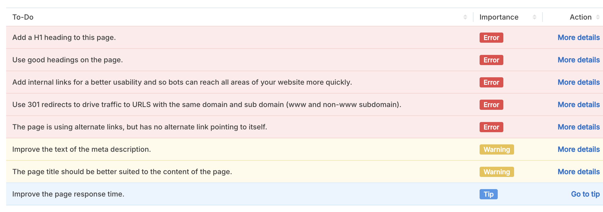

*** SEO Issue ***

Background and foreground colors do not have a sufficient contrast ratio.
These are opportunities to improve the legibility of your content.
Best practices
Touch targets do not have sufficient size or spacing.
Document does not have a main landmark.

Document does not have a valid rel=canonicalPoints to another `hreflang` location (https://www.leegoscaffolding.com/en)
Requests are blocking the page's initial render, which may delay LCP. Deferring or inlining can move these network requests out of the critical path.LCPFCPUnscored
Polyfills and transforms enable older browsers to use new JavaScript features. However, many aren't necessary for modern browsers. Consider modifying your JavaScript build process to not transpile Baseline features, unless you know you must support older browsers. Learn why most sites can deploy ES6+ code without transpilingLCPFCPUnscored
Reduce unused JavaScript and defer loading scripts until they are required to decrease bytes consumed by network activity. Learn how to reduce unused JavaScript.LCPFCPUnscored

This website either doesn't have a favicon or this has not been referenced correctly!

A Google Analytics script is not detected on this page. While there are several tools available to monitor your site's visitors and traffic sources, Google Analytics is a free, commonly recommended program to help diagnose potential SEO issues.

This webpage is using more than 20 http requests, which can slow down page loading and negatively impact user experience!

This webpage is not serving resources (images, javascript and css) from CDNs!

This webpage is using render blocking resources! Eliminating render-blocking resources can help this webpage to load significantly faster and will improve the website experience for your visitors.

The First Contentful Paint value of this webpage is 9.020 seconds. To provide a good user experience, Google recommends that sites should strive to have a First Contentful Paint value of 1.8 seconds or less.

The Largest Contentful Paint duration of this webpage is 9.64 seconds. To provide a good user experience, Google recommends that sites should strive to have Largest Contentful Paint of 2.5 seconds or less.

https://www.leegoscaffolding.com/en and https://leegoscaffolding.com/en should resolve to the same URL, but currently do not.

This webpage is not using the Strict-Transport-Security header! This is a security header that was created as a way to force the browser to use secure connections when a site is running over HTTPS.

We've found 1 email addresses in your page code! We advise you to protect email links in a way that hides them from the spam harvesters.

This website is not using a custom 404 error page! Default 404 error pages result in a poor experience - it can mislead users into thinking an entire site is down or broken, greatly increases the chance they leave the website entirely, and looks unprofessional. We recommend to have a custom 404 error page in order to improve the website's user experience by letting users know that only a specific page is missing/broken (and not the entire site), providing them helpful links, the opportunity to report bugs, and potentially track the source of broken links.

This webpage is using the canonical link tag. This tag specifies that the URL: https://leegoscaffolding.com/en should be the preferred version of this page. The canonical tag can be useful when there are similar versions of the same content on several URLs (e.g., such as e-commerce sites where URL modifiers like sort parameters are appended to a product page's URL). Please ensure that this specification is correct, as canonical tags are often hard-coded and may not always reflect the latest changes in a site's URL structure.

This DNS server is not using an SPF record! SPF (Sender Policy Framework) allows administrators to specify which hosts are allowed to send mail from a given domain by creating a specific SPF record or TXT record in the Domain Name System (DNS). You can find more information about SPF records here.

The request of ads.txt file has an unexpected Content-Type header: text/html; charset=utf-8. In order for this resource to be easily accessed by the DSPs and advertisers, its Content-Type header should be text/plain or text/plain; charset=utf-8.

ssues to fix
HIGH
To address URL canonicalization issues, it is recommended to select a primary URL for your webpage and set up redirects from all other variations to the preferred one.
HIGH
To provide a good user experience, Google recommends that sites should aim for a Largest Contentful Paint duration of 2.5 seconds or less.
HIGH
To improve the website experience for your visitors, it is recommended to eliminate any render-blocking resources on this webpage.
HIGH
Users may abandon pages that take longer than 5 seconds to load, resulting in a potential loss of up to 50% of visitors. Faster loading pages can lead to increased traffic, better conversions, and higher sales.
HIGH
To ensure that Search Engines can accurately identify the topic of this webpage, it is important to include the most common keywords in the title tag, meta description, and heading tags.
MEDIUM
Serving resources (images, JS, CSS) from a CDN service, could improve website loading times, reduce bandwidth costs and increase content availability and redundancy.
MEDIUM
By creating a custom 404 error page with helpful links and information, users are more likely to stay on the site and continue to explore.
MEDIUM
Avoid using distorted images, as they can have a negative impact on the user experience.
MEDIUM
Serve properly sized images to reduce page loading times and to improve user's experience.
MEDIUM
To provide a good user experience, Google recommends that sites should aim for a First Contentful Paint value of 1.8 seconds or less.
MEDIUM
Add a Google Analytics script to this website to help in diagnosing potential SEO issues by monitoring site visitors and traffic sources.
LOW
While a canonical link tag can help in resolving duplicate content issues, it's important to verify that the specified URL is accurate, especially if the site's URL structure has been recently updated.
LOW
Without an SPF record, spammers can easily spoof emails from this domain, potentially leading to compromised email security and deliverability issues.
LOW
Consider adding the Strict-Transport-Security header to your webpage to ensure that web traffic is encrypted over HTTPS, mitigating the risk of man-in-the-middle attacks and other security threats.
LOW
Using more than 20 HTTP requests on a webpage can negatively impact the loading time.
LOW
This website either lacks a favicon or it has not been referenced properly.